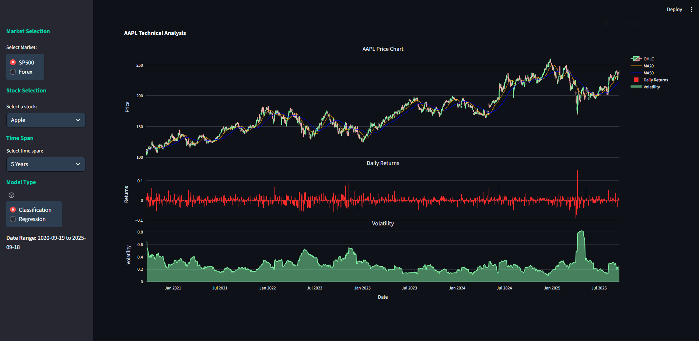
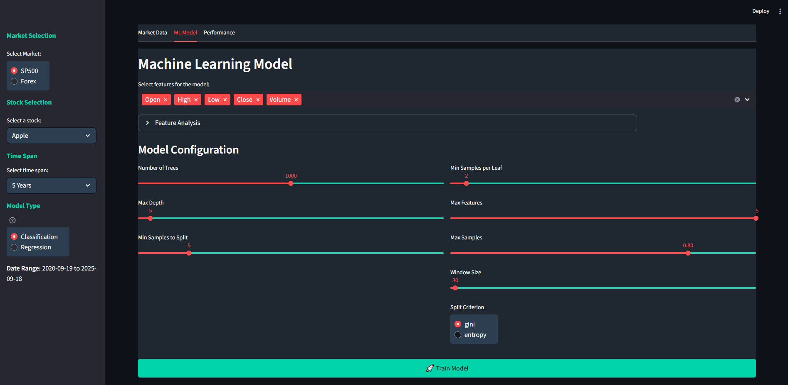
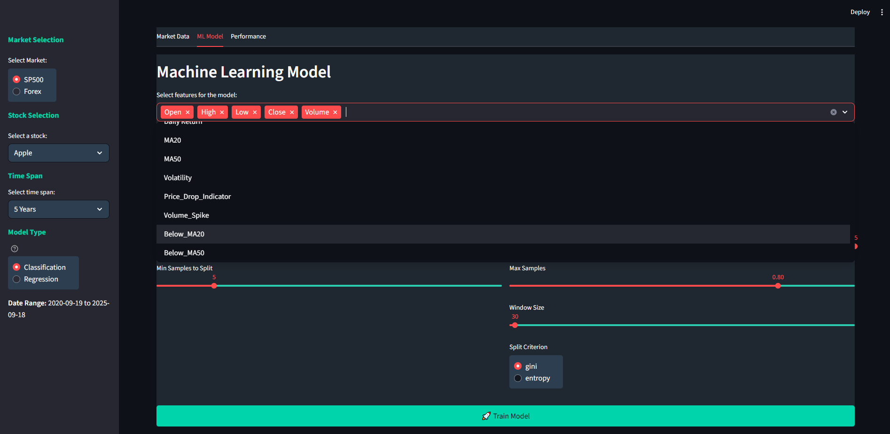
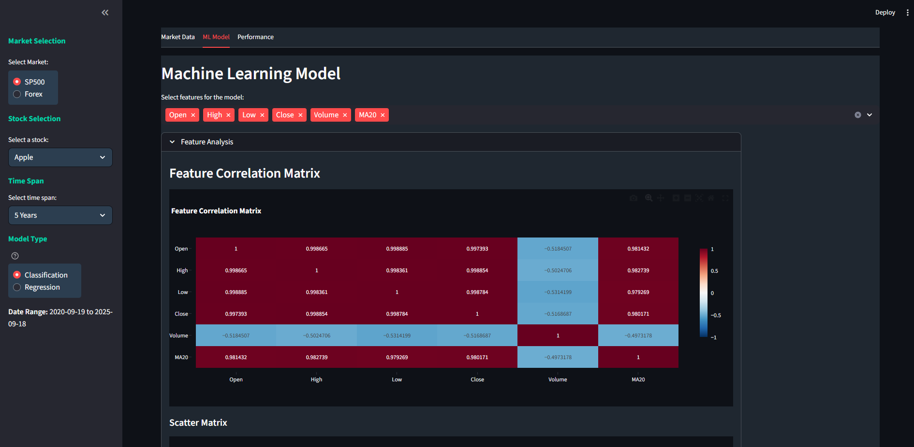
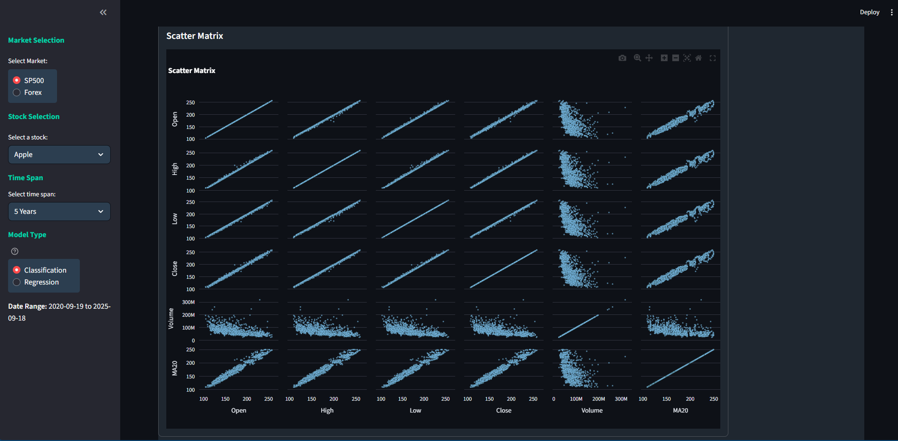
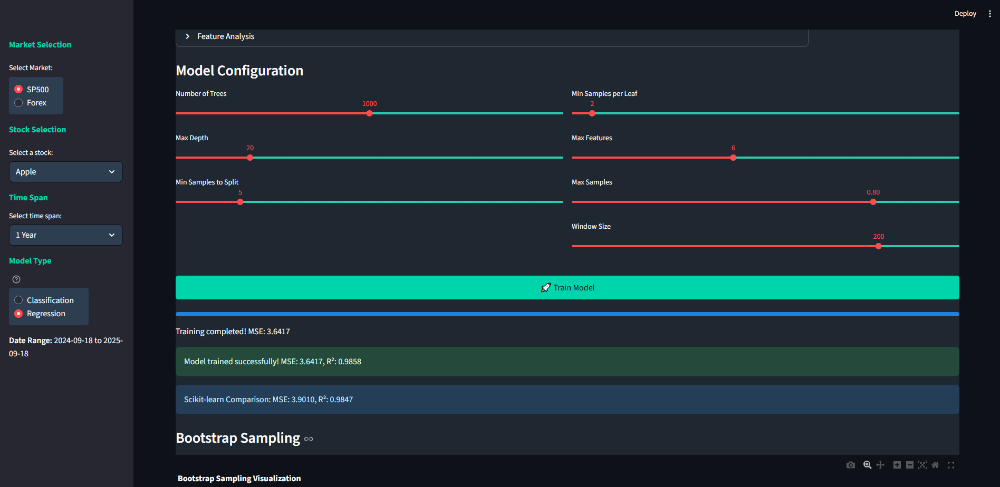
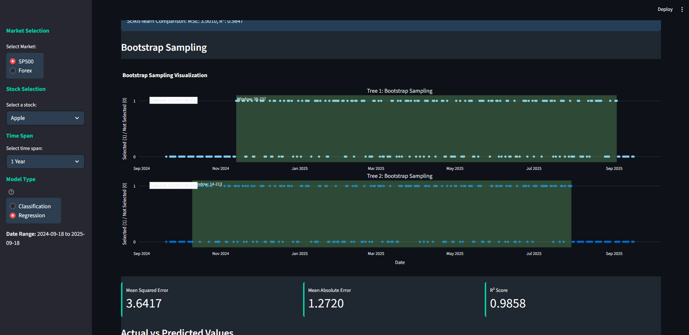

# Random-Forest-Model-applied-to-the-Stock-Market

THis project includes code that was developed from scratch to make Random Forest models (RFM), including a Classifier with replacement spliting criteria (Gini or Entropy) and a Regressor model for continuous price evaluation. 

The structure of the files are as follows: \
\
Stock_Model/ \
├── app/ \
│   ├── data_loader.py \
│   ├── data_processor.py \
│   ├── update_visualiser.py \
│   ├── Random_Forest_Model_Classifier.py \
│   └── Random_Forest_Model_Regressor.py \
├── data/ \
│   └── (cached data files from Alpha Vantage) \
├── images/ \
│   ├── dashboard-overview.png \
│   ├── market-data-tab.png \
│   └── (other screenshots) \
├── main.py \
├── requirements.txt \
├── README.md \

---
## The Project
Interactive financial analysis dashboard featuring custom Random Forest models (RFM) for stock &amp; forex prediction. Compares performance of personally made RFM against sklearn with visualisations, technical indicators, and Alpha Vantage integration, along with Analysis of results of classifier or regressor models.
---

---
### Main Dashboard

#### Figure 1
* __Real-Time Data__: Fetch and then visualise stock/forex data from Alpha Vantage API.
One can select what stock to look at, either SP500 or Forex, the time span to look over, and the specific ticker.
---
### Market Data Analysis

#### Figure 2
* __Technical Indicators__: Automatic calculation of MA20, MA50, volatility and, daily returns.
* __Interactive Charts__: Candlestick charts with zoom and pan functionality.
---
### Machine Learning Capabilities
#### Select the next Tab to see the ML page:
Here the chosen model is trained on the data selected by the user.
* __Dual Model Types__: Classification (price direction) and Regression (price value).
* __Feature Selection__: Choose from technical indicators and price data.(see Figure 4)
* __Feature Evaluation__: Correlation and scatter matrices are displayed for selected features. (see Figure 5 & 6)
* __Hyperparameter Tuning__: Adjust model parameters through sliders. (see Figure 7)
The window slider is because the RFM work through bootstrapping, as this is a forecasting problem, the base learners are trained individually on windows of the dataset instead of random sampling. (see Figure 8)

#### Figure 3

#### Figure 4

#### Figure 5

#### Figure 6

#### Figure 7

#### Figure 8
---
### Perfomance of RFM
