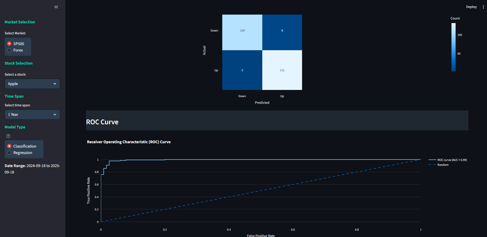
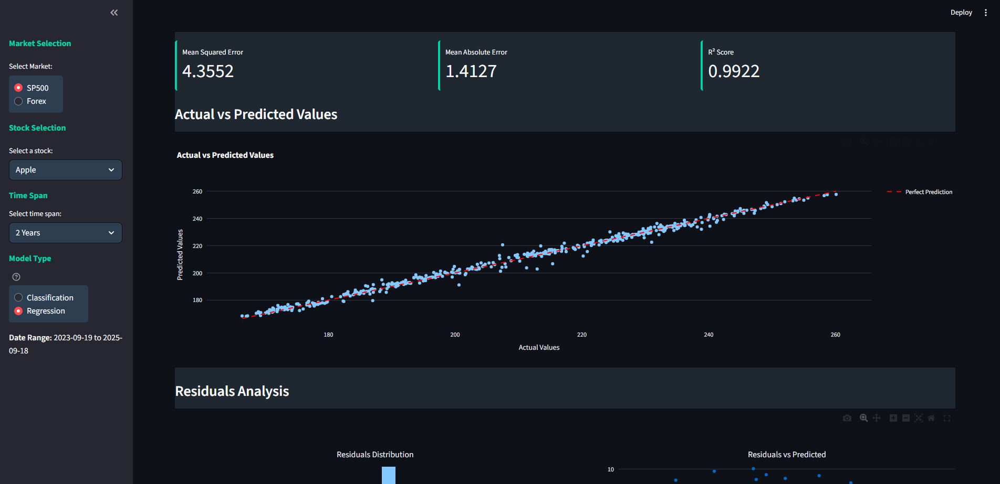

# Random-Forest-Model-applied-to-the-Stock-Market

THis project includes code that was developed from scratch to make Random Forest models (RFM), including a Classifier with replacement spliting criteria (Gini or Entropy) and a Regressor model for continuous price evaluation. 

The structure of the files are as follows: \
\
Stock_Model/ \
├── app/ \
│   ├── data_loader.py \
│   ├── data_processor.py \
│   ├── update_visualiser.py \
│   ├── Random_Forest_Model_Classifier.py \
│   └── Random_Forest_Model_Regressor.py \
├── data/ \
│   └── (cached data files from Alpha Vantage) \
├── images/ \
│   ├── dashboard-overview.png \
│   ├── market-data-tab.png \
│   └── (other screenshots) \
├── main.py \
├── requirements.txt \
├── README.md \

---
## The Project
Interactive financial analysis dashboard featuring custom Random Forest models (RFM) for stock &amp; forex prediction. Compares performance of personally made RFM against sklearn with visualisations, technical indicators, and Alpha Vantage integration, along with Analysis of results of classifier or regressor models.
---

---
### Main Dashboard

#### Figure 1
* __Real-Time Data__: Fetch and then visualise stock/forex data from Alpha Vantage API.
One can select what stock to look at, either SP500 or Forex, the time span to look over, and the specific ticker.
---
### Market Data Analysis

#### Figure 2
* __Technical Indicators__: Automatic calculation of MA20, MA50, volatility and, daily returns.
* __Interactive Charts__: Candlestick charts with zoom and pan functionality.
---
### Machine Learning Capabilities
#### Select the next Tab to see the ML page:
Here the chosen model is trained on the data selected by the user.
* __Dual Model Types__: Classification (price direction) and Regression (price value).
* __Feature Selection__: Choose from technical indicators and price data.(see Figure 4)
* __Feature Evaluation__: Correlation and scatter matrices are displayed for selected features. (see Figure 5 & 6)
* __Hyperparameter Tuning__: Adjust model parameters through sliders. (see Figure 7)
The window slider is because the RFM work through bootstrapping, as this is a forecasting problem, the base learners are trained individually on windows of the dataset instead of random sampling. This dashboard shows two of these bootstrapping windows (see Figure 8)

#### Figure 3

#### Figure 4

#### Figure 5

#### Figure 6

#### Figure 7

#### Figure 8
---
### Perfomance of RFM
* __Benchmarking__: These custom models are compared to the scikit-learn implementations.
* __Metrics__: Depending on the model used (either Classifier or Regressor) the metrics are evaluated for the RFM. \
\
---
The following figure shows the results of the Classifier model with the respective metrics and visualisations outputted.

#### Figure 9
---
The following figure shows the results of the Regressor model with the respective metrics and visualisations outputted.

---
\

# Technical Architecture
* __Frontend__: Streamlit with custom CSS styling
* __Machine Learning__: Custom Random Forest Classifier and Regressor with optimised selection quality selection and bootstrapping.
* __Data Processing__: Pandas, NumPy for technical indators.
* __Visualisation__: Plotly for interactive charts, Matplotlib for metrics.
* __Data Source__: Alpha Vantage (AV) Stock Market API with local caching (data is stored to .csv's because of maximum of 25 API requests per day limit from AV.
---
# Installation
1. Clone the repository:
> git clone https://github.com/EdwardWardell02/Random-Forest-Model-applied-to-the-Stock-Market.git
2.  Install dependencies
> pip install -r requirements.txt
3. Set your Alpha Vantage API key in `app/data_loader.py`. \

4. Run application:
> streamlit run main.py
